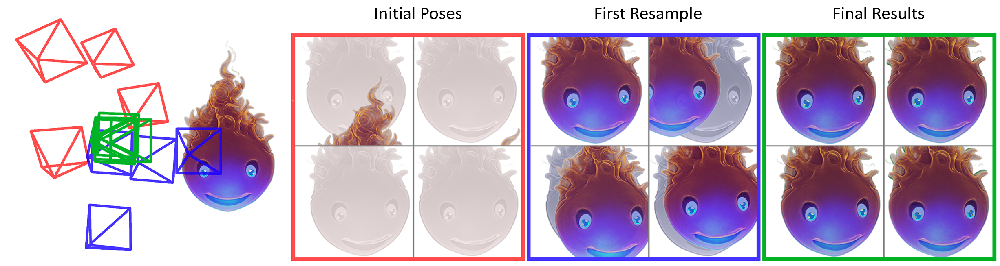

# Parallel Inversion NeRF



## Overview


This repository is the official implementation of the paper [Parallel Inversion of Neural Radiance Fields for Robust Pose Estimation](https://arxiv.org/abs/2210.10108) by Lin et al., ICRA 2023 (full citation below).  For videos, please visit the [Parallel Inversion NeRF project site](https://pnerfp.github.io/). 

In this work, we present a parallelized optimization method based on fast Neural Radiance Fields (NeRF) for estimating 6-DoF pose of a camera with respect to an object or scene. Given a single observed RGB image of the target, we can predict the translation and rotation of the camera by minimizing the residual between pixels rendered from a fast NeRF model and pixels in the observed image. We integrate a momentum-based camera extrinsic optimization procedure into Instant Neural Graphics Primitives, a recent exceptionally fast NeRF implementation. By introducing parallel Monte Carlo sampling into the pose estimation task, our method overcomes local minima and improves efficiency in a more extensive search space. We also show the importance of adopting a more robust pixel-based loss function to reduce error. Experiments demonstrate that our method can achieve improved generalization and robustness on both synthetic and real-world benchmarks. The algorithm takes an average of 25 seconds on an NVIDIA GTX 3090 GPU.

## Installation


The code was tested on Ubuntu 20.04, with [Anaconda](https://www.anaconda.com/download) Python 3.9. Other versions should be possible with some accuracy difference. NVIDIA GPUs are needed for both training and testing.

1. Preparation for [Instant NGP](https://github.com/NVlabs/instant-ngp#requirements)
  
~~~sh
$ sudo apt-get install build-essential git python3-dev python3-pip libopenexr-dev libxi-dev \
libglfw3-dev libglew-dev libomp-dev libxinerama-dev libxcursor-dev
~~~

2. Clone this repo:

~~~sh
$ REPO_ROOT=/path/to/clone/ParallelInversion
$ git clone --recursive https://github.com/NVlabs/ParallelInversion.git $REPO_ROOT
~~~

3. Create an Anaconda environment or create your own virtual environment

~~~sh
$ conda create -n pinerf python=3.9
$ conda activate pinerf
$ pip install -r requirements.txt
~~~

4. Build the project using CMake

~~~sh
$ cmake . -B build -DCMAKE_BUILD_TYPE=RelWithDebInfo  
$ cmake --build build --config RelWithDebInfo -j  
~~~

## Dataset

To play with scenes presented in the paper, download the data [here](https://drive.google.com/drive/folders/128yBriW1IG_3NJ5Rp7APSTZsJqdJdfc1). Place the downloaded dataset according to the following directory structure:
```
                                                                                    
├── data/nerf                                                                                                                                                                                                       
│   ├── nerf_llff_data                                                                                                  
│   │   └── fern                                             
│   │   └── fortress    
|   |   └── ...
|   ├── nerf_synthetic
|   |   └── chair
|   |   └── drums    
|   |   └── ...
```

Following [NeRF-Pytorch](https://github.com/yenchenlin/nerf-pytorch) and [Instant-NGP](https://github.com/NVlabs/instant-ngp), we further preprocess LLFF dataset by converting it to the NeRF format. We provide the script `colmap2nerf.py` to convert the specific dataset format to the NeRF format (saving a json file). 

```sh 
$ cd REPO_ROOT/scripts
$ export PYTHONPATH='../'

$ python preprocess_llff.py
```

For a sanity check, you can visualize the converted dataset by running the following command:

```sh 
$ cd REPO_ROOT/scripts
$ export PYTHONPATH='../'

$ python run_debug.py --config config/debug/default.yaml
```

## Evaluation

We evaluate our method on NeRF Synthetic and LLFF datasets. 

```sh
$ cd REPO_ROOT/scripts
$ export PYTHONPATH='../'

## Main

# Evaluation on NeRF Synthetic dataset
$ python exp_nerf_synthetic.py --config config/exp/exp_nerf_synthetic.yaml
$ python exp_nerf_synthetic.py --config config/exp/exp_nerf_synthetic_multiGuess.yaml

# Evaluation on LLFF dataset
$ python exp_nerf_llff.py --config config/exp/exp_nerf_llff.yaml
$ python exp_nerf_llff.py --config config/exp/exp_nerf_llff_multiGuess.yaml

## Ablation study

# Evaluation on NeRF Synthetic dataset with simulated noise
$ python exp_nerf_synthetic.py --config config/exp/exp_nerf_synthetic_noisy.yaml --eval_mode ablation_rgb_loss

# Evaluation on LLFF dataset
$ python exp_nerf_llff.py --config config/exp/exp_nerf_llff.yaml --eval_mode ablation_rgb_loss
```

We also provide the options to generate visualization results. An example is shown below:

```sh
$ cd REPO_ROOT/scripts
$ export PYTHONPATH='../'

$ python run_pose_refinement.py --config config/demo/nerf_synthetic_hotdog_multiGuess.yaml
````

You can get the following result:


## Acknowledgements

In this repository, we have used codes or datasets from the following repositories. 
We thank all the authors for sharing great codes or datasets.

- [Instant-NGP](https://github.com/NVlabs/instant-ngp)
- [NeRF-pytorch](https://github.com/yenchenlin/nerf-pytorch)

## Citation


Please cite the following if you use this repository in your publications:

```
@inproceedings{lin2023icra:parallel,
  title={Parallel Inversion of Neural Radiance Fields for Robust Pose Estimation},
  author={Lin, Yunzhi and Müller, Thomas and Tremblay, Jonathan and Wen, Bowen and Tyree, Stephen and Evans, Alex and Vela, Patricio A. and Birchfield, Stan},
  booktitle={IEEE International Conference on Robotics and Automation (ICRA)},
  year={2023}
}
```

## Licence


Parallel Inversion NeRF is licensed under the [NVIDIA Source Code License - Non-commercial](LICENSE.txt).
